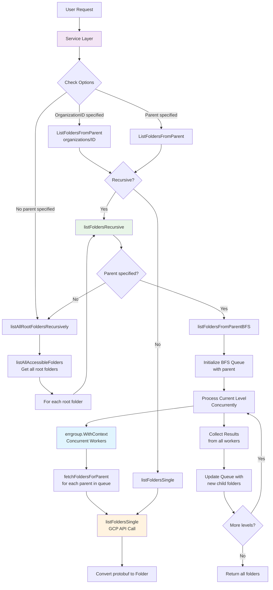

# Architecture Documentation

This document describes the architecture and design patterns used in the gcphelper project.

## Folder Fetching System (`pkg/folders/`)

The folder fetching system provides efficient retrieval of Google Cloud folder hierarchies with support for concurrent processing, recursive traversal, and flexible querying patterns.

### Architecture Overview

The folder fetching system uses a layered architecture that separates concerns between user experience, business logic, and API interaction:

```text
┌──────────────────┐
│   Service Layer  │  ← Progress indicators, high-level operations
├──────────────────┤
│ Fetcher Interface│  ← Contract definition for folder operations
├──────────────────┤
│ Client Layer     │  ← Google Cloud API integration, concurrency
├──────────────────┤
│ Data Types       │  ← Folder struct, configuration options
└──────────────────┘
```

### Components

#### 1. Service Layer (`service.go`)

- **Purpose**: High-level interface with user experience features
- **Key Features**:
  - Progress indicators using spinner during long-running operations
  - Simplified API for common use cases
  - Resource management and cleanup
- **Location**: `service.go:17-112`

#### 2. Fetcher Interface (`fetcher.go`)

- **Purpose**: Defines the contract for folder fetching operations
- **Methods**:
  - `ListFolders(ctx, opts)` - Lists all accessible folders
  - `ListFoldersFromParent(ctx, parent, opts)` - Lists folders under specific parent
  - `Close()` - Resource cleanup
- **Location**: `fetcher.go:15-25`

#### 3. Client Implementation (`fetcher.go`)

- **Purpose**: Low-level Google Cloud Resource Manager API client
- **Key Features**:
  - Concurrent processing with configurable limits
  - Breadth-first search algorithm for recursive traversal
  - Cycle detection with thread-safe visited tracking
  - Comprehensive error handling with context cancellation
- **Location**: `fetcher.go:27-278`

#### 4. Data Types (`types.go`)

- **Purpose**: Core data structures and configuration
- **Key Types**:
  - `Folder` - Represents a Google Cloud folder resource
  - `FetchOptions` - Configuration for fetch behavior
- **Location**: `types.go:11-98`

### Fetching Strategies

The system supports multiple fetching strategies optimized for different use cases:

#### 1. Single Level Fetching

- Fetches only direct children of a specified parent
- Used when `opts.Recursive = false`
- Implementation: `listFoldersSingle()` - Direct API call

#### 2. Recursive BFS Traversal

- Uses breadth-first search with concurrent processing
- Processes folders level-by-level to optimize memory usage
- Maintains visited map with mutex protection to prevent cycles
- Implementation: `listFoldersFromParentBFS()`

#### 3. Root Discovery Mode

- Discovers all accessible folders when no parent is specified
- First fetches all root folders, then recursively processes each
- Implementation: `listAllRootFoldersRecursively()`

### Concurrency Model

The system uses sophisticated concurrency patterns for optimal performance:

```go
// Concurrent processing with errgroup
g, gCtx := errgroup.WithContext(ctx)
g.SetLimit(opts.Concurrency)  // Default: 10

// Worker pattern for parallel API calls
for _, parentRes := range queue {
    g.Go(func() error {
        return c.fetchFoldersForParent(gCtx, parentRes, foldersCh, errorsCh)
    })
}
```

**Key Features**:

- **Bounded Concurrency**: Configurable limit (default: 10) prevents API overwhelming
- **Error Propagation**: Uses `errgroup` for coordinated error handling
- **Context Cancellation**: Supports graceful cancellation across all workers
- **Channel Communication**: Results collected via channels for thread-safe aggregation

### Data Flow



### Design Patterns

#### 1. Interface Segregation

- `Fetcher` interface defines minimal contract
- Enables dependency injection and testing with mocks
- Clean separation between API client and business logic

#### 2. Strategy Pattern

- Different fetching strategies based on options
- Single vs recursive vs root discovery modes
- Configurable concurrency and behavior

#### 3. Worker Pool Pattern

- `errgroup` manages concurrent workers
- Bounded concurrency prevents resource exhaustion
- Coordinated error handling and cancellation

#### 4. Builder Pattern

- `FetchOptions` with sensible defaults
- `NewFetchOptions()` provides configured instances
- Fluent configuration API

### Performance Characteristics

#### Memory Efficiency

- BFS approach processes folders level-by-level
- No deep recursion stack maintenance required
- Visited map prevents cycle-induced memory leaks

#### Network Efficiency

- Concurrent API calls within configured limits
- Request batching at the level boundary
- Early termination on context cancellation

#### Error Resilience

- Individual parent failures don't stop entire operation
- Comprehensive error wrapping with context
- Graceful degradation on partial failures

### Testing Strategy

The system uses comprehensive testing patterns:

#### Mock-Based Testing

- `mockFoldersClient` simulates GCP API responses
- `mockFolderIterator` provides controlled iteration
- Table-driven tests cover multiple scenarios

#### Test Coverage Areas

- Single level and recursive fetching
- Error conditions and API failures
- Concurrency behavior and race conditions
- Resource cleanup and lifecycle management

### Configuration

#### Default Values

```go
const DefaultConcurrency = 10

// NewFetchOptions creates defaults
func NewFetchOptions() *FetchOptions {
    return &FetchOptions{
        Concurrency: DefaultConcurrency,
        Recursive:   true,
    }
}
```

#### Customization Options

- `OrganizationID`: Scope fetching to specific organization
- `Concurrency`: Control parallel API request limit
- `Recursive`: Enable/disable hierarchical traversal

### Future Considerations

1. **Caching**: Add optional result caching for repeated queries
2. **Pagination**: Handle large result sets with pagination
3. **Filtering**: Add server-side filtering capabilities
4. **Metrics**: Add performance metrics and monitoring hooks
5. **Rate Limiting**: Implement adaptive rate limiting based on API quotas
